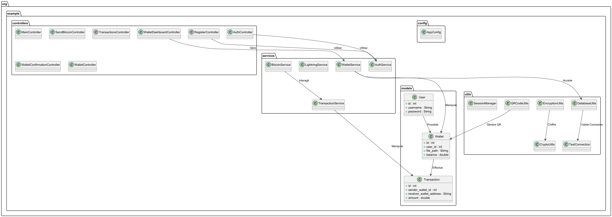
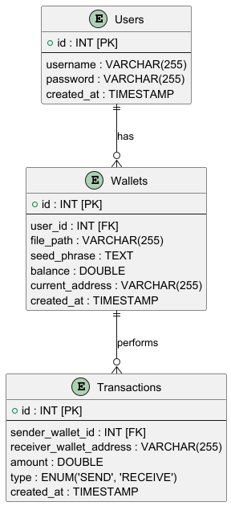
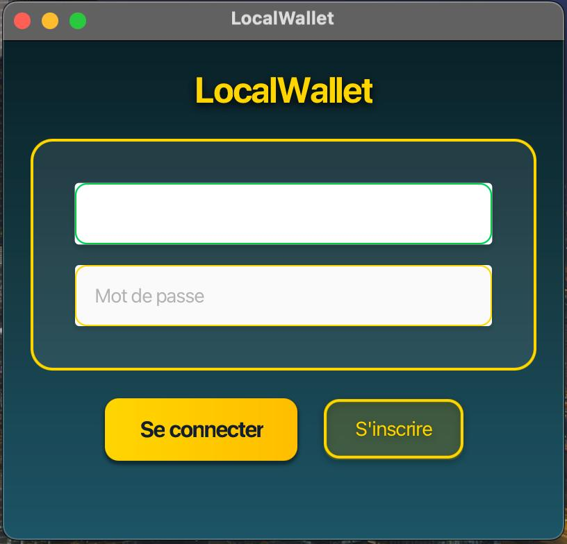
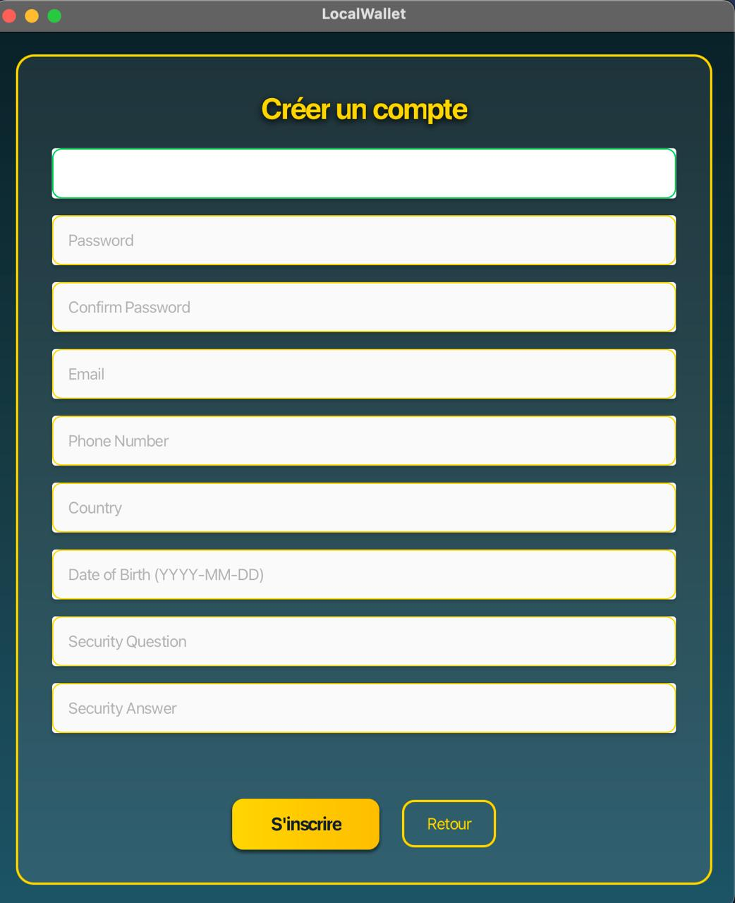
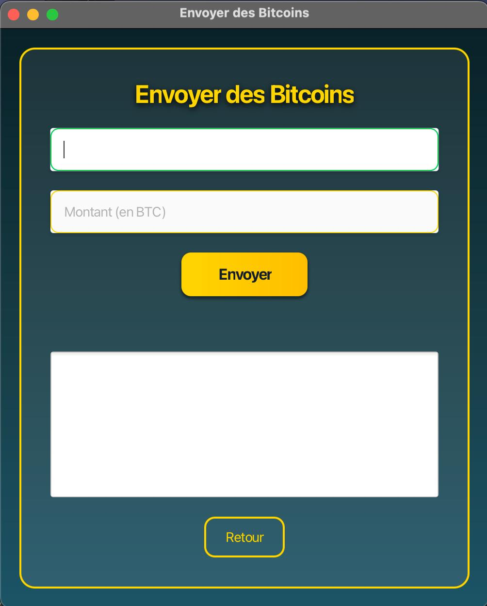
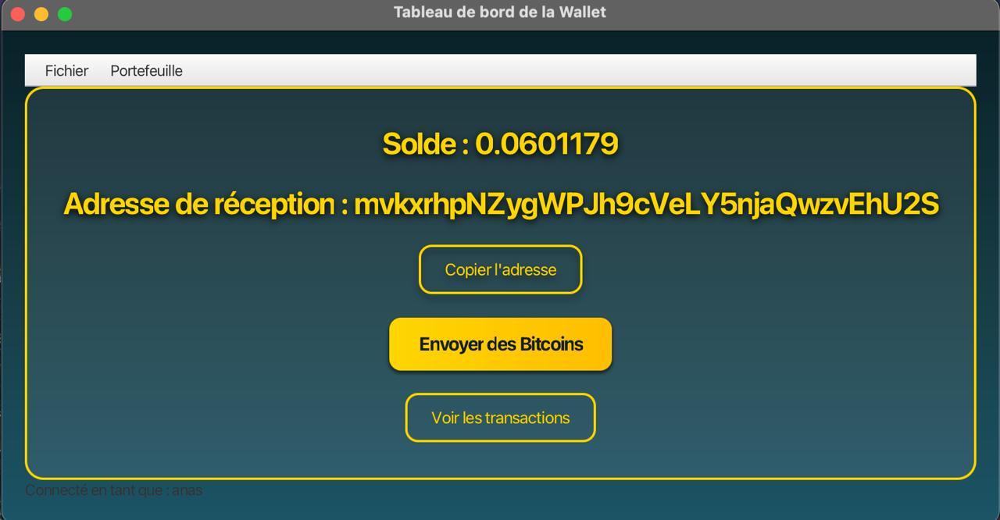

#  LocalWallet

Bienvenue dans **LocalWallet**, une application de portefeuille Bitcoin développée en Java et JavaFX, offrant des fonctionnalités essentielles comme la gestion des transactions et le suivi des soldes.

---

## 📋 Aperçu du projet

LocalWallet est conçu pour fournir une interface conviviale et sécurisée pour gérer vos transactions Bitcoin. Avec une architecture bien structurée et une interface intuitive, ce projet illustre les meilleures pratiques de développement logiciel.

---

## 📂 Organisation du projet

### Structure des packages :
- `controllers` : Gestion de la logique métier et de l'interface utilisateur.
- `models` : Représentation des entités principales comme les transactions.
- `services` : Implémentation de la logique métier comme la gestion des portefeuilles.
- `utils` : Outils auxiliaires (chiffrement, gestion de sessions, etc.).

---

## 📊 Diagrammes

### UML Diagram


### Diagramme relationnel de la base de données (ERD)


---

## 📸 Captures d'écran de l'application

### Écran de connexion


### Écran d'inscription


### Envoi de Bitcoin


### Tableau de bord du portefeuille


---

## 📜 Fonctionnalités principales

- **Gestion sécurisée des utilisateurs** : Chiffrement des données sensibles.
- **Génération de QR Codes** : Simplifie le partage des adresses Bitcoin.
- **Interface utilisateur intuitive** : Conçue pour la simplicité et la clarté.
- **Architecture MVC** : Séparation claire des responsabilités.

---

## 🚀 Comment exécuter le projet

1. Cloner le dépôt :
   ```bash
   git clone https://github.com/RAZIMOUAD/localwallet.git
2. Configurer la base de données MYSQL :
   .importer les schémas SQL fournis
3. compiler et exécuter avec Maven :
      mvn clean install
      mvn javafx:run 
---
🔗 Ressources utiles
JavaFX Documentation
BitcoinJ Documentation
MySQL Documentation
